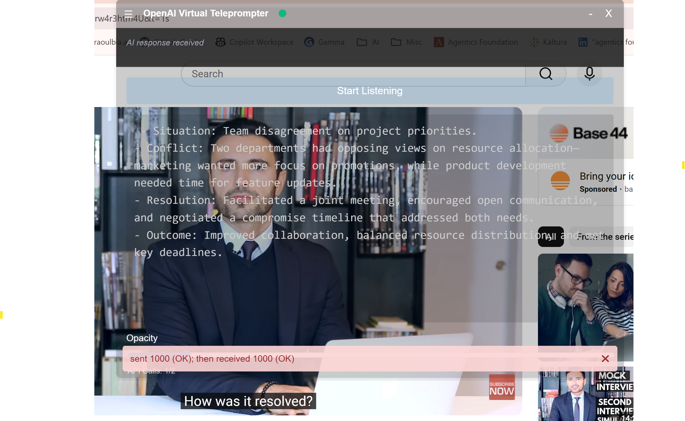

# OpenAI Virtual Teleprompter

**Ace your job interviews with AI-powered assistance in real-time!**

The OpenAI Virtual Teleprompter is an innovative Electron desktop application that captures interviewer questions through your speakers and generates intelligent, concise answers instantly. Powered by OpenAI's Realtime API, this transparent, always-on-top overlay provides discreet AI assistance during virtual interviews on Teams, Zoom, or any video platform—helping you stay confident and articulate when it matters most.

## Introduction

Preparing for job interviews can be nerve-wracking, especially when you're put on the spot with tough technical questions or behavioral scenarios. The OpenAI Virtual Teleprompter levels the playing field by capturing the interviewer's questions in real-time (using VB-Audio Cable to route speaker audio) and instantly generating bullet-point answers tailored to your needs.

**How it helps you:**
- **Stay Calm Under Pressure**: Read AI-generated talking points while maintaining eye contact with your camera
- **Answer Confidently**: Get concise, relevant answers to questions as they're asked
- **Never Go Blank**: Always have a structured response ready, reducing interview anxiety
- **Learn as You Go**: See how to frame professional answers to common and uncommon questions
- **Discreet Assistance**: Transparent Electron overlay sits on top of your video call without being obvious

**Key features:**
- **Speaker Audio Capture**: Routes interviewer's voice from speakers to AI (via VB-Audio Cable)
- **Real-time AI Answers**: Generates bullet-point responses as questions are asked
- **Spacebar Control**: Pause/resume audio capture to avoid sending your own voice to the API
- **Always-on-Top Overlay**: Electron desktop app stays visible over Teams/Zoom
- **Adjustable Transparency**: Change opacity to see content behind the window
- **Resizable & Draggable**: Position and size the window to fit your screen layout

Whether you're interviewing for your dream job, preparing for technical screenings, or practicing for behavioral interviews, the OpenAI Virtual Teleprompter provides intelligent, real-time support when you need it most.

## Table of Contents

- [Features](#features)
- [Screenshots](#screenshots)
- [Prerequisites](#prerequisites)
- [Installation](#installation)
  - [Backend Setup](#backend-setup)
  - [Frontend Setup](#frontend-setup)
- [Usage](#usage)
  - [Running the Application](#running-the-application)
  - [Interacting with the Assistant](#interacting-with-the-assistant)
- [Configuration](#configuration)
- [Logging](#logging)
- [Testing](#testing)
- [Utilities](#utilities)
- [Contributing](#contributing)
- [License](#license)
- [Acknowledgments](#acknowledgments)

## Features

**Interview Assistance:**
- **Speaker Audio Capture via VB-Cable**: Captures the interviewer's questions from your speakers (not your microphone), allowing you to hear questions normally while the AI processes them
- **Real-time AI Answer Generation**: OpenAI Realtime API converts interviewer questions to text and generates concise, bullet-point answers instantly
- **Spacebar Pause/Resume Control**: Quickly pause audio capture before speaking your answer, resume when ready for the next question
- **Discreet Overlay Display**: Read AI suggestions while maintaining eye contact with your camera

**Desktop Application (Electron + React):**
- **Always-on-Top Window**: Transparent, frameless overlay stays visible over Teams/Zoom/any application
- **Draggable & Resizable**: Position and size the teleprompter window to fit your screen layout
- **Adjustable Opacity**: Change transparency to see content behind the window
- **Native Windows Support**: Designed specifically for Windows 11 with PowerShell

**Technical Features:**
- **WebSocket Communication**: Real-time communication between Python backend and Electron frontend
- **OpenAI Realtime API Integration**: Direct WebSocket connection to OpenAI for low-latency audio processing
- **Automatic Device Selection**: Detects Windows default recording device (CABLE Output when configured)
- **Voice Activity Detection (VAD)**: WebRTC VAD detects speech in audio streams for efficient processing
- **Automatic Session Management**: Reconnects to OpenAI every 10 minutes to bypass 15-minute session limits
- **Error Handling and Logging**: Comprehensive logging with rotation for troubleshooting

**Note**: This application is currently a Proof of Concept (PoC). While successfully tested for interview scenarios, users may encounter bugs or issues. Contributions and feedback are welcome!

## Screenshots



This screenshot showcases the OpenAI Virtual Teleprompter interface, featuring:
- A "Start Listening" button to begin speech recognition
- A response area displaying the assistant's transcription and suggestions
- An API call counter to track usage
- An opacity slider for adjusting the interface transparency

## Prerequisites

- **Python 3.10+** (recommended for best compatibility with dependencies)
- **Node.js 14+**
- **npm**
- **An OpenAI API Key**: You need to have an API key from OpenAI to use their services.
- **PortAudio**: Required for PyAudio installation.
- **PyAudio**: For audio input/output in Python.
- **Electron**: For running the frontend application.

## Installation

### Backend Setup

1. **Clone the Repository**

   ```bash
   git clone https://github.com/raoulbia-ai/gpt-meeting-assistant-electron.git
   cd gpt-meeting-assistant-electron/backend
   ```

2. **Create a Virtual Environment**

   ```bash
   python -m venv venv
   source venv/bin/activate  # On Windows use `venv\Scripts\activate`
   ```

3. **Install Python Dependencies**

   Ensure you have PortAudio installed on your system, which is required for PyAudio.

   - On **Ubuntu/Debian**:

     ```bash
     sudo apt-get install libportaudio2
     ```

   - On **macOS** (using Homebrew):

     ```bash
     brew install portaudio
     ```

   Then install the Python dependencies:

   ```bash
   pip install -r requirements.txt
   ```

   - **On Windows**:
     - Installing `PyAudio` on Windows can sometimes be tricky if you don't have the necessary C++ build tools.
     - **Method 1 (Recommended): Use the included pre-compiled wheel.** This repository includes a pre-compiled PyAudio wheel for Python 3.14 on Windows 64-bit in the `backend` directory:
       ```bash
       pip install backend/pyaudio-0.2.14-cp314-cp314-win_amd64.whl
       ```
     - **Method 2: Install Microsoft C++ Build Tools.** Download and install the "Build Tools for Visual Studio" from the [Visual Studio website](https://visualstudio.microsoft.com/visual-cpp-build-tools/). Make sure to select the "C++ build tools" workload during installation. After installation, try `pip install pyaudio` again.
     - **Method 3: Download other pre-compiled wheels.** If you're using a different Python version, you can find unofficial pre-compiled PyAudio wheels for Windows [here](https://www.lfd.uci.edu/~gohlke/pythonlibs/#pyaudio). Download the wheel file (`.whl`) corresponding to your Python version and system architecture (e.g., `PyAudio‑0.2.14‑cp310‑cp310‑win_amd64.whl` for Python 3.10 64-bit).
     - After successfully installing PyAudio, install the rest of the requirements:
       ```bash
       pip install -r requirements.txt
       ```

4. **Set Up Configuration**

   - **OpenAI API Key** (Required):

     You need an OpenAI API key to use this application. Get your API key from: https://platform.openai.com/api-keys

     **Method 1 (Recommended): Use .env file**

     This method persists your API key across terminal sessions without having to re-export it each time.

     ```bash
     # Copy the example file
     cp .env.example .env

     # Edit .env and replace the placeholder with your actual API key
     # .env file should contain:
     # OPENAI_API_KEY=sk-your-actual-key-here
     ```

     **Method 2 (Alternative): Set environment variable manually**

     Set the `OPENAI_API_KEY` environment variable in your terminal (needs to be set each session):

     - On **Linux/macOS**:

       ```bash
       export OPENAI_API_KEY='your_openai_api_key'
       ```

     - On **Windows PowerShell**:

       ```powershell
       $env:OPENAI_API_KEY='your_openai_api_key'
       ```

   - **Configuration File**:

     The `config.py` file contains settings you can adjust:

     - `max_api_calls`: Maximum number of API calls (`-1` for unlimited).
     - `silence_threshold`, `cooldown_duration`: Silence detection settings.
     - `rate`, `channels`, `frame_duration_ms`: Audio settings.

### Frontend Setup

1. **Navigate to the Root Directory**

   ```bash
   cd ../  # Assuming you're in the backend directory
   ```

2. **Install Node.js Dependencies**

   ```bash
   npm install
   ```

3. **Build the Frontend**

   ```bash
   npm run build
   ```

4. **Ensure Electron is Installed**

   If Electron is not installed globally, you can install it as a dev dependency (already included in `package.json`):

   ```bash
   npm install electron --save-dev
   ```

### Windows 11: Capturing Speaker Audio (VB-Audio Cable Setup)

To capture audio from applications like Microsoft Teams or YouTube (interviewer's questions), you need to configure Windows to route speaker output to a virtual audio device that the teleprompter can capture from.

1. **Download VB-Audio Virtual Cable**
   - Visit: https://vb-audio.com/Cable/
   - Download the ZIP file for Windows

2. **Install VB-Audio Cable**
   - Extract the ZIP file
   - Right-click `VBCABLE_Setup_x64.exe` → Run as administrator
   - Click "Install Driver"
   - **Restart your computer** (required)

3. **Configure Audio Devices**
   - Press `Win+R` → Type `mmsys.cpl` → Press Enter (opens Sound Control Panel)
   - **Playback tab**: Right-click "CABLE Input" → Set as Default Device
   - **Recording tab**: Right-click "CABLE Output" → Set as Default Device
   - Right-click "CABLE Output" → Properties → Levels tab → Set volume to **100%**
   - Right-click "CABLE Output" → Properties → Listen tab:
     - Check ☑ "Listen to this device"
     - Select your speakers (e.g., Dell monitor) from the dropdown
     - Click OK

**Result**: Audio from Teams, YouTube, or any application will be routed through the virtual cable and captured by the teleprompter, while you still hear it through your speakers.

## How the Application Works

The OpenAI Virtual Teleprompter is designed to help you during interviews by capturing the interviewer's questions and generating AI-powered answers in real-time. Here's how it works:

1. **Speaker Audio Capture**: When configured with VB-Audio Cable, the application captures audio from your speakers (not your microphone). This means it captures what the interviewer is saying through Teams, Zoom, or any other application playing audio through your speakers.

2. **Automatic Device Selection**: On startup, the application automatically selects your Windows default recording device. With VB-Cable configured, this will be "CABLE Output" which captures your speaker audio.

3. **Question Processing**: When the interviewer asks a question, their audio is captured from your speakers, sent to OpenAI's Realtime API, and converted to text.

4. **AI Answer Generation**: The OpenAI API processes the interviewer's question and generates a concise, bullet-point answer based on the assistant instructions configured in `config.py`.

5. **Real-time Display**: The AI-generated answer appears immediately in the floating teleprompter window, allowing you to read and formulate your response while maintaining eye contact with your camera.

6. **Customizable Interface**: The floating prompter can be moved around the screen and its opacity adjusted, ensuring it doesn't interfere with your meeting video or other applications.

### Usage in Virtual Meetings

The teleprompter is designed for interview scenarios where you need real-time assistance answering questions. Here's the typical setup:

**Audio Configuration:**
- **Your Microphone** (webcam or USB mic): Used for speaking to the interviewer in Teams/Zoom - the interviewer hears you through this
- **VB-Audio Cable Output**: Captures the interviewer's audio from your speakers and sends it to the teleprompter
- **Your Speakers**: You hear the interviewer's questions through your normal speakers (Dell monitor, headphones, etc.)

**How It Works:**
1. The interviewer asks a question → audio plays through your speakers
2. VB-Cable routes this speaker audio to "CABLE Output" (recording device)
3. The teleprompter captures from "CABLE Output" and sends to OpenAI
4. AI generates an answer → displayed in the teleprompter window
5. You read the answer and speak your response into your webcam/USB mic
6. The interviewer hears your spoken answer through Teams/Zoom

**Important**: You only need ONE microphone for speaking. The teleprompter captures the interviewer's voice from speakers via VB-Cable, not from a microphone.

### Interacting with the Teleprompter

**Basic Controls:**

- **Start Listening**: Click the "Start Listening" button to begin capturing audio from speakers (interviewer's questions)
- **View AI Answers**: Read the AI-generated answers displayed in the response area as they appear in real-time
- **Adjust Opacity**: Use the slider to change the transparency of the floating prompter (helpful for seeing content behind the window)
- **Reposition**: Click and drag the top bar to move the floating prompter anywhere on your screen
- **Resize**: Drag the bottom-right corner to resize the window

**Spacebar Control (Important!):**

The **Spacebar** is your primary control for managing when the teleprompter captures audio. Here's why and how to use it:

**WHY use the spacebar:**
- Prevents the teleprompter from capturing YOUR voice while you're speaking your answer to the interviewer
- Gives you control over when to send audio to the OpenAI API (avoids unnecessary API calls)
- Allows you to pause and think before capturing the next question

**WHEN to use the spacebar:**
- **Press spacebar BEFORE speaking your answer** → This pauses audio capture so the teleprompter doesn't send your voice to OpenAI
- **Press spacebar AFTER you finish speaking** → This resumes audio capture, ready to capture the interviewer's next question

**HOW it works:**
- Press spacebar once → Listening pauses (button shows "Resume Listening")
- Press spacebar again → Listening resumes (button shows "Pause Listening")
- You can also click the button directly instead of using the spacebar

**Typical Workflow:**
1. Click "Start Listening" → Teleprompter captures audio
2. Interviewer asks question → AI answer appears
3. Press **Spacebar** → Pause (stop capturing)
4. Read AI answer and speak your response to interviewer
5. Press **Spacebar** → Resume (ready for next question)
6. Repeat steps 2-5 throughout the interview

By using the spacebar effectively, you maintain control over the conversation flow while getting real-time AI assistance.

### Interaction Flow

Here's the typical interaction flow during an interview:

1.  **Initialization:** Start the Python backend server in PowerShell Terminal 1, then launch the Electron frontend in PowerShell Terminal 2.

2.  **UI Appears:** A floating, transparent window (the "teleprompter") appears on screen, always on top. The window contains:
    - "Start Listening" button
    - Response area (dark gray box where AI answers appear)
    - API call counter (tracks OpenAI API usage)
    - Opacity slider
    - Resize handle (white L-shape in bottom-right corner)

3.  **Start Interview:** Click the "Start Listening" button to begin capturing audio from your speakers via VB-Cable.

4.  **Audio Capture from Speakers:** The application captures audio from "CABLE Output" (your speaker audio), which includes the interviewer's voice from Teams/Zoom.

5.  **Real-time Processing:**
    - Interviewer asks a question → Audio plays through your speakers
    - VB-Cable routes speaker audio to "CABLE Output"
    - Backend captures audio and sends to OpenAI Realtime API via WebSocket
    - OpenAI converts speech-to-text and generates an answer based on the `instructions` in `config.py`
    - AI-generated answer is sent back to the frontend via WebSocket

6.  **Display AI Answer:** The AI-generated answer appears in the response area of the teleprompter in real-time as the interviewer speaks.

7.  **User Response Workflow:**
    - **Interviewer asks question** → AI answer displays in teleprompter
    - **Press Spacebar** → Pause audio capture (prevents capturing your voice)
    - **Read the AI answer** → Formulate your response
    - **Speak your answer** → Into webcam/USB mic (interviewer hears you through Teams)
    - **Press Spacebar** → Resume audio capture (ready for next question)

8.  **Additional Controls:**
    - **Reposition:** Click and drag the top bar to move the window
    - **Resize:** Drag the bottom-right corner to adjust window size
    - **Adjust Opacity:** Use the slider to change transparency
    - **Monitor API Usage:** Check the API call counter to track OpenAI usage

9.  **End Interview:** Click "Stop Listening" or close the application when the interview is complete.


## Configuration

The application can be customized using the `config.py` file in the `backend` directory.

### Configuration Options

- **API Key and URL**: Set your OpenAI API key and endpoint URL.
- **Audio Settings**:
  - `rate`: Sample rate (default is 48000 Hz).
  - `channels`: Number of audio channels (default is 1).
  - `frame_duration_ms`: Duration of each audio frame in milliseconds.
- **Assistant Settings**:
  - `max_api_calls`: Maximum number of API calls (`-1` for unlimited).
  - `silence_threshold`: Threshold for detecting silence.
  - `cooldown_duration`: Duration to wait before listening again after a response.
  - `instructions`: Instructions or guidelines for the assistant's responses.

### Frontend Configuration

- **Opacity**: Adjusted within the UI using the slider.
- **Keyboard Shortcuts**:
  - **Spacebar**: Toggle pause/resume listening.
- **Window Behavior**:
  - The Electron window is set to always be on top and is transparent, providing an unobtrusive overlay.

## Logging

Logging is configured using the `common_logging.py` module in the `backend` directory. It sets up both file and console logging with options for rotation and formatting.

### Adjusting Logging Levels

You can adjust the logging level in your scripts when initializing the logger:

```python
from common_logging import setup_logging

logger = setup_logging('your_module_name', debug_to_console=True)
```

- **Parameters**:
  - `name`: Name of the logger.
  - `debug_to_console` (bool): If `True`, logs will also output to the console.
  - `filter_response_done` (bool): If `True`, applies a filter to only log specific messages.

### Log Files

- Logs are stored in the `logs` directory within `backend`.
- Each module has its own log file, e.g., `voice_assistant.log`, `openai_client.log`.

## Testing

The `tests` directory contains scripts to verify the functionality of audio devices and API interactions.

### Running Audio Tests

```bash
cd tests
python test_audio.py
```

- This script tests audio recording from your microphone and saves it to `output.wav`.
- Ensure your microphone is properly connected and recognized by the system.
- The script will use your system's default microphone or prompt you to select from available devices.

### Additional Tests

- **PulseAudio and PyAudio Tests**: `test_pulseaudio_and_pyaudio.py` can help diagnose audio issues on systems using PulseAudio.

## Utilities

### Kill Ports Script

The `utils/kill_ports.py` script checks for processes running on specific ports (e.g., 8000 and 3000) and terminates them. This is useful for ensuring that the required ports are free before starting the application.

#### Usage

```bash
cd utils
python kill_ports.py
```

- The script uses `lsof` to find and kill processes. It may require elevated permissions depending on your system configuration.
- Modify the script if you need to check different ports.

## Contributing

We welcome contributions from the community! To contribute:

1. **Fork the Repository**

2. **Create a Feature Branch**

   ```bash
   git checkout -b feature/YourFeature
   ```

3. **Commit Your Changes**

   ```bash
   git commit -m "Add your message"
   ```

4. **Push to Your Fork**

   ```bash
   git push origin feature/YourFeature
   ```

5. **Create a Pull Request**

   - Navigate to the original repository and open a pull request.

## Environment and Compatibility

The OpenAI Virtual Teleprompter is designed to be compatible with both Windows and Linux operating systems. The application supports any audio input device and automatically detects your system's default microphone on startup.

### Important Notes:

1. **Operating System Compatibility**: This application is designed to be compatible with both Windows and Linux.

2. **Microphone Configuration**: The application automatically selects your system's default microphone on startup. It supports any audio input device including:
   - Built-in laptop microphones
   - Monitor built-in microphones
   - Webcam microphones
   - USB microphones (e.g., Blue Yeti, Rode, Audio-Technica)
   - Professional audio interfaces

   Optimal performance is generally achieved with high-quality microphones, but the application will work with any available audio input device.

3. **Dual Microphone Setup for Virtual Meetings**: When using the Teleprompter during virtual meetings, you may need to use two separate microphones:
   - One dedicated to the Teleprompter application (set as your Windows default microphone)
   - Another for your meeting audio (e.g., your webcam's built-in microphone)

4. **Performance Considerations**: The application's performance may vary depending on your system specifications and the quality of your audio input.

## License

This project is licensed under the [MIT License](LICENSE).

## Acknowledgments

- **OpenAI**: For providing the powerful API that drives our intelligent teleprompter.
- **Electron**: For the framework that enables our desktop application interface.
- **PyAudio**: For reliable audio input processing in Python.
- **Contributors**: A heartfelt thanks to all who have contributed to this project.
- **Community**: For the ongoing support, feedback, and inspiration.

---

*We welcome your questions, feedback, and contributions! Feel free to open an issue if you need assistance or have suggestions for improvement.*

## Running the Application (Development Mode)

**Note**: This application is designed for Windows. Use PowerShell to run the following commands.

To run the OpenAI Virtual Teleprompter in development mode, you'll need to use two PowerShell terminal windows:

1.  **PowerShell Terminal 1 - Start the Backend Server:**
    Navigate to the `backend` directory, activate your virtual environment, and start the Python WebSocket server:
    ```powershell
    cd backend
    .\venv\Scripts\Activate.ps1
    python start_websocket_server.py
    ```
    Keep this terminal running. On first run, you'll be prompted to select your audio device (select "CABLE Output" if using VB-Audio Cable setup).

2.  **PowerShell Terminal 2 - Start the Electron Frontend:**
    In a new PowerShell terminal window, navigate to the root directory of the project and launch the Electron app:
    ```powershell
    npm start
    ```
    This command builds the frontend and launches the Electron application.

**Important**: Make sure the backend server (Terminal 1) is running before launching the Electron app (Terminal 2).

## Building the Application (Production)

To create distributable packages for Windows or Linux, use the provided build script. This script utilizes `electron-builder` to package the application.

1.  **Navigate to the Project Root:**
    Ensure you are in the main project directory in your terminal.

2.  **Run the Build Script:**

    *   **Build for the current OS:**
        ```bash
        ./utils/build.sh
        ```
        The script will attempt to detect your operating system (Linux or Windows) and build accordingly.

    *   **Force build for a specific platform:**
        ```bash
        # Build for Windows
        ./utils/build.sh --win

        # Build for Linux
        ./utils/build.sh --linux
        ```
        Use the `--win` or `--linux` flag to explicitly target a platform. Note that cross-compiling (e.g., building for Linux on Windows) might require additional setup like Docker. Refer to the `electron-builder` documentation for details.

3.  **Find the Output:**
    The build process will install dependencies, build frontend assets (if applicable), and then package the Electron application. The distributable files (e.g., `.exe` for Windows, `.AppImage` or `.deb` for Linux) will be located in the `dist` directory within the project root.

---

For any additional information or specific sections you'd like to expand upon, please don't hesitate to ask. We're committed to making this README as informative and helpful as possible.
